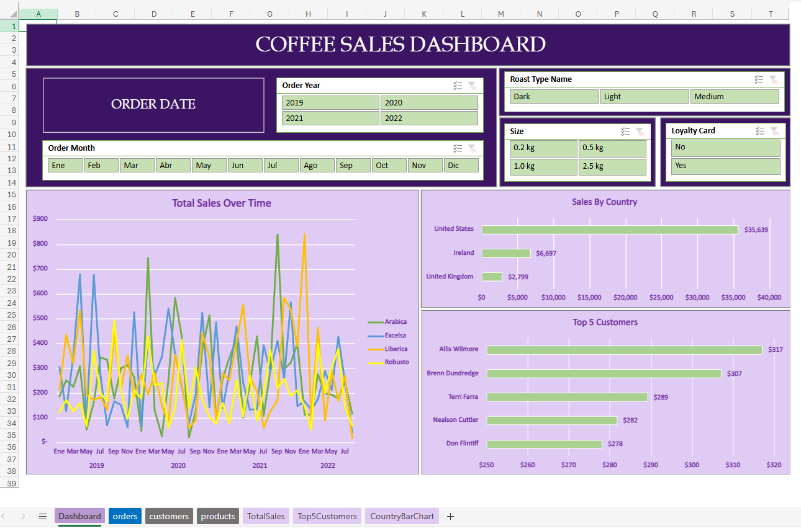
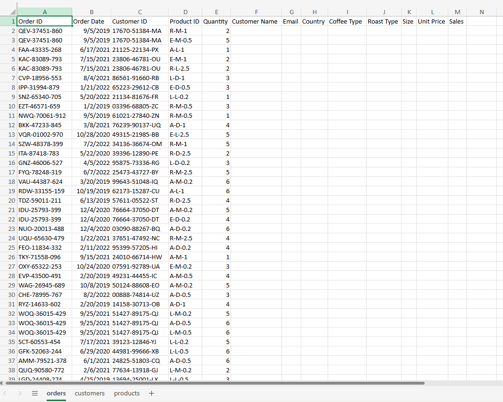
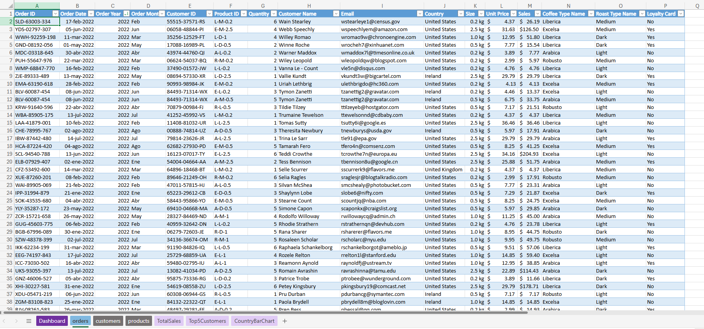
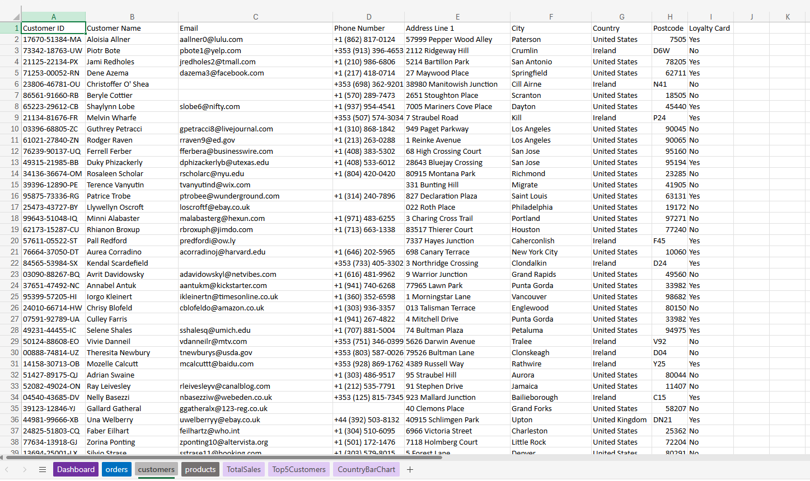
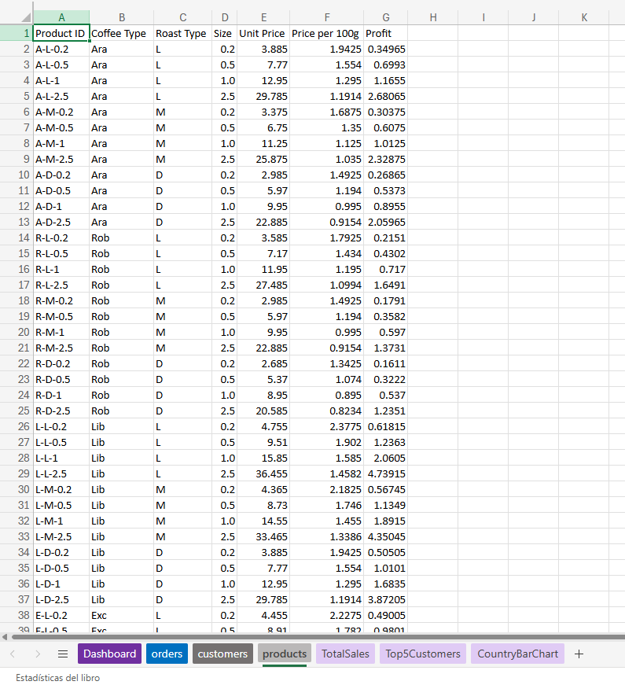

# Coffee Sales Analysis (Excel)

Análisis de ventas de café utilizando Microsoft Excel, incluyendo procesos de limpieza, transformación y visualización de datos mediante tablas dinámicas y dashboards interactivos.

---

## Objetivo

Organizar y transformar un dataset relacional (customers, products y orders) para realizar un análisis estructurado de las ventas y desarrollar un dashboard interactivo que facilite su interpretación.

---

## Herramientas utilizadas

- Tablas dinámicas  
- Gráficos dinámicos  
- Segmentaciones (slicers)  
- Funciones de Excel (BUSCARX, INDICE + COINCIDIR, SI.CONJUNTO, funciones de fecha, entre otras)

---

## Proceso

1. Integración de datos entre múltiples hojas  
2. Limpieza y completado de valores faltantes  
3. Transformación de variables y creación de columnas auxiliares  
4. Estandarización de datos categóricos
5. Formateo de datos (fechas, precios, unidades)   
6. Construcción de tablas dinámicas  
7. Desarrollo de dashboard interactivo  

---

## Análisis realizados

- Evolución de ventas a lo largo del tiempo  
- Ventas por país  
- Top 5 clientes por volumen de compra  
- Análisis dinámico mediante segmentaciones  

---

## Dataset

El dataset contiene información sobre ventas de café, incluyendo:

- Clientes  
- Productos  
- Pedidos  
- Precios y cantidades  
- Información geográfica  

---

## Dashboard

---

## Visualización de datos

### Dataset original

### Dataset procesado

### Tablas auxiliares

#### Customers

#### Products

---

## Archivos del proyecto

- `coffee_orders_analysis.xlsx` → tabla, análisis y dashboard  
- `data/data_coffee_orders.xlsx` → dataset original  
- `images/` → capturas del proyecto  

---

## Nota

Este proyecto fue desarrollado utilizando Microsoft Excel (Office 365), por lo cual algunas funcionalidades avanzadas de visualización o personalización pueden ser limitadas.
